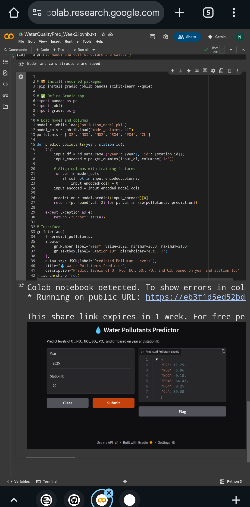
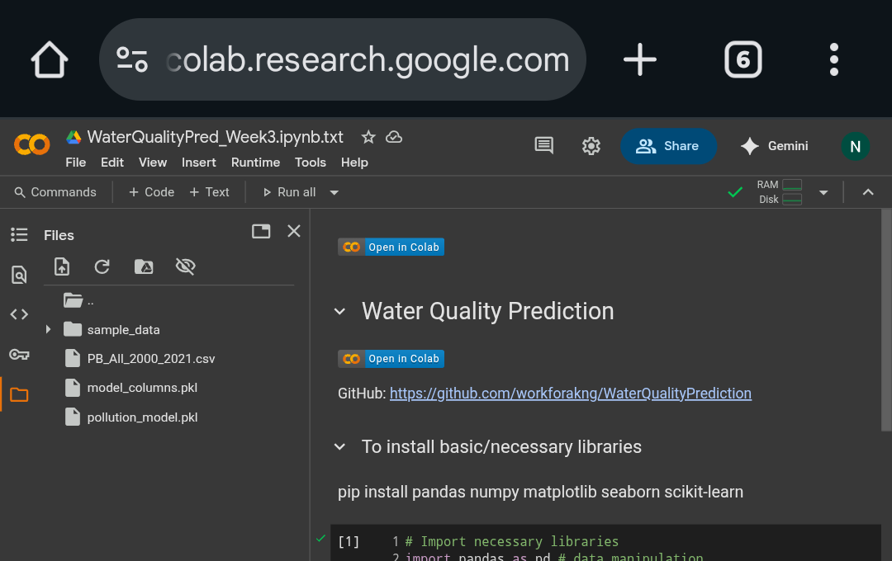
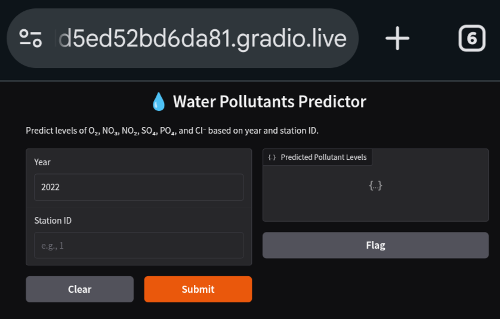

# 💧 Water Quality Prediction

This AI-powered project predicts six major **water pollutants** using historical station-based monitoring data and the year. The goal is to support environmental analysis and forecasting using machine learning techniques.

---

## 🚀 Run the App

### ▶️ In Google Colab  
Click below to launch the prediction app in 1 cell:

👉 **[Run on Colab](https://colab.research.google.com/github/workforakng/WaterQualityPrediction/blob/main/WaterQualityPred_Week3_.ipynb)**

## 📁 Dataset Summary

- **File:** `PB_All_2000_2021.csv`
- **Time Period:** 2000–2021
- **Input Features:** Year, Station ID
- **Output Pollutants:**
  - O₂ (Dissolved Oxygen)
  - NO₃ (Nitrate)
  - NO₂ (Nitrite)
  - SO₄ (Sulfate)
  - PO₄ (Phosphate)
  - Cl⁻ (Chloride)

---

## 📈 Project Pipeline

1. **Data Cleaning**  
2. **EDA & Visualization**  
3. **Model Building** (Multi-output Random Forest Regressor)  
4. **Streamlit → Gradio Conversion**  
5. **Web Deployment via Gradio in Colab**

---

## 📊 Project Screenshots

> _(Make sure to upload these images inside a folder called `images/`)_

### 📌 EDA and Feature Visualization


### ⚙️ Model Training and Output


### 🌐 Gradio Web App Interface


---

## 🛠 Tools & Libraries

- Python
- Pandas, NumPy
- Scikit-learn
- Matplotlib, Seaborn
- Gradio (`app.py`)
- Joblib / Pickle for model persistence

---

## 📅 Weekly Progress

### ✅ Week 1: Data Preparation
- Loaded dataset from CSV
- Cleaned null values, filtered key stations
- Visualized pollutant trends

### ✅ Week 2: Model Training
- Used **MultiOutputRegressor** with **RandomForestRegressor**
- Input: `year`, `station_id`
- Output: O₂, NO₃, NO₂, SO₄, PO₄, Cl
- Saved:
  - `pollution_model.pkl`
  - `model_columns.pkl`

### ✅ Week 3: Deployment
- Converted Streamlit app to Gradio
- Created `app.py` for local or online use
- ✅ Deployed in Google Colab using `gr.Interface(...)`

---

### ▶️ Locally using Gradio

```bash
pip install -r requirements.txt
python app.py